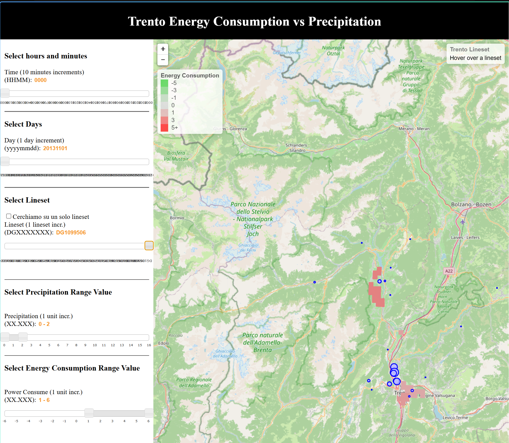
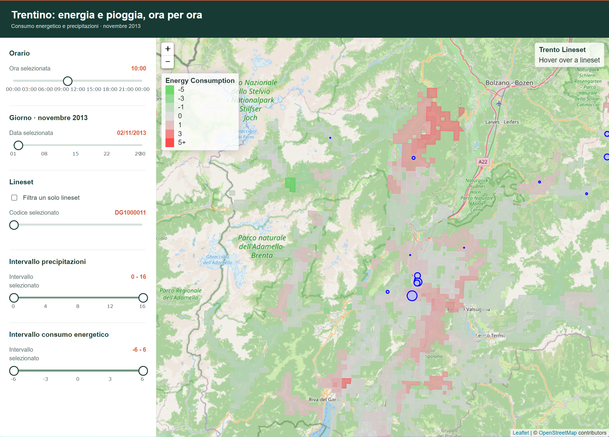
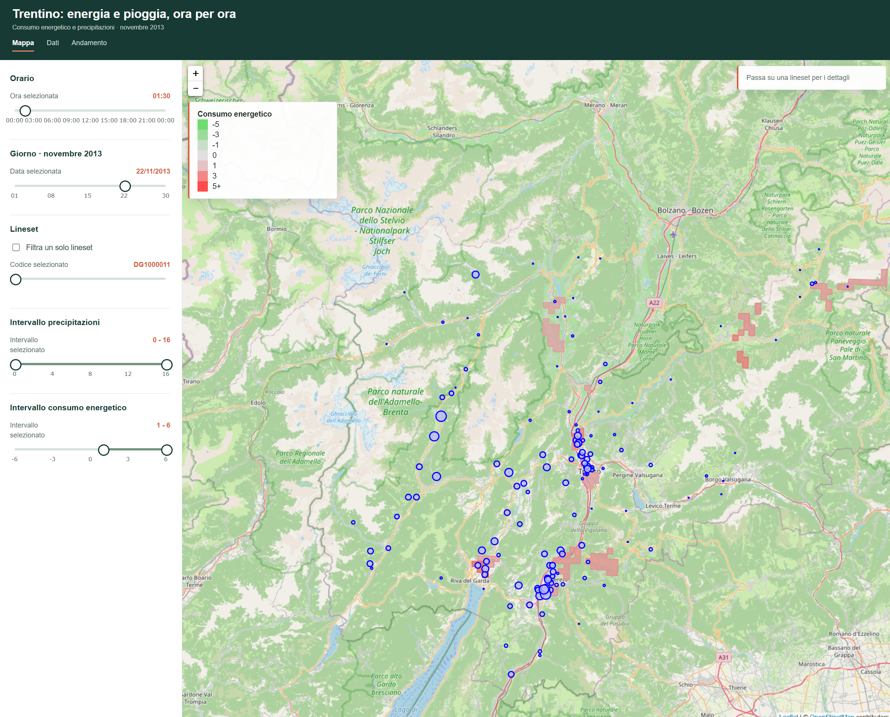
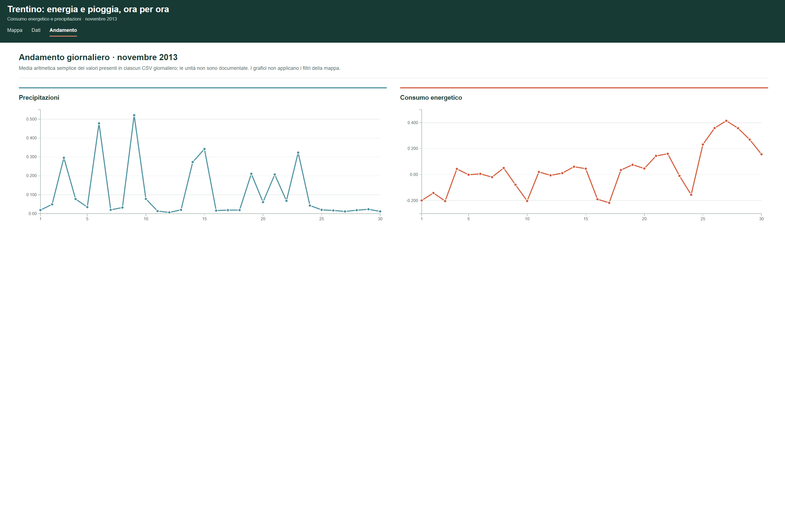
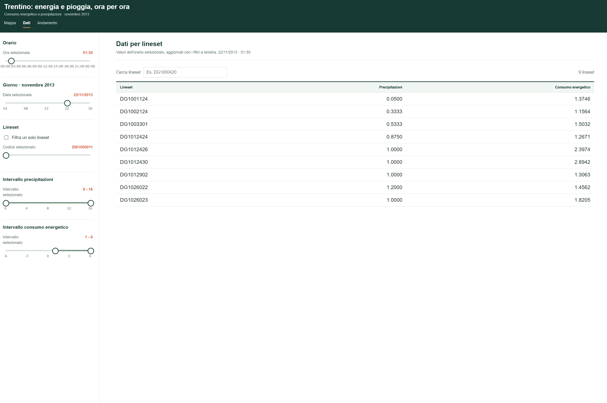

# Evoluzione dell'interfaccia

[Indice](Home.md) | [Funzionalita](Funzionalita.md)

Questa pagina racconta, attraverso le cinque schermate conservate nel repository, il passaggio da una prima mappa a una dashboard con filtri e viste distinte. E' una ricostruzione visiva: le immagini documentano gli stati mostrati, ma non stabiliscono da sole date, commit o l'intera sequenza di sviluppo. Anche i dati mostrati cambiano tra le schermate, perche' giorno e orario selezionati non sono sempre gli stessi.

## 1. Start: la prima mappa

La schermata iniziale mette al centro la mappa e sovrappone consumo energetico e precipitazioni. I controlli sono gia' presenti, ma sono densi, con etichette in inglese e slider affollati. La navigazione e' concentrata in un'unica pagina: non ci sono ancora schede visibili per passare a viste analitiche separate.

## 2. More 1: controlli riorganizzati

I controlli passano all'italiano e vengono disposti in sezioni piu' riconoscibili: orario, giorno, lineset e intervalli per precipitazioni e consumo. La mappa mantiene il ruolo principale e la legenda aiuta a leggere il colore del consumo. I controlli restano pero' piuttosto compressi e la schermata non offre ancora viste dedicate a tabella e grafici.

## 3. More 2: la mappa diventa una vista

La mappa entra in una struttura piu' ampia: l'intestazione identifica il progetto, le schede introducono tre destinazioni e i filtri sono raccolti in una barra laterale piu' stretta. La mappa resta la vista d'apertura, ma non e' piu' l'unico modo di esplorare i dati.

## 4. More 2.g: lettura dell'andamento

La scheda Andamento affianca due grafici: precipitazioni e consumo energetico nel corso di novembre 2013. Questa vista rende piu' immediato confrontare la variazione giornaliera delle due serie, senza sovrapporle alla geografia della mappa. La schermata precisa che i grafici non applicano i filtri della mappa e che le unita' non sono documentate.

## 5. More 2.t: confronto per lineset

La scheda Dati sostituisce la lettura spaziale con una tabella consultabile: ogni riga rappresenta una lineset e mostra precipitazioni e consumo per l'istante selezionato. Una casella di ricerca consente di trovare un codice. I controlli temporali e gli intervalli rimangono disponibili a sinistra, mantenendo il contesto della selezione.

## In sintesi

La progressione visibile e' da un prototipo centrato sulla mappa a una dashboard articolata in viste coordinate: mappa per la distribuzione spaziale, andamento per il confronto giornaliero e tabella per il dettaglio delle lineset. Le schermate mostrano una crescita dell'organizzazione e della leggibilita'; non dimostrano da sole che i valori, le aggregazioni o i dati siano cambiati tra una versione e l'altra. Per il comportamento verificato della dashboard attuale, vedere [Funzionalita](Funzionalita.md).
